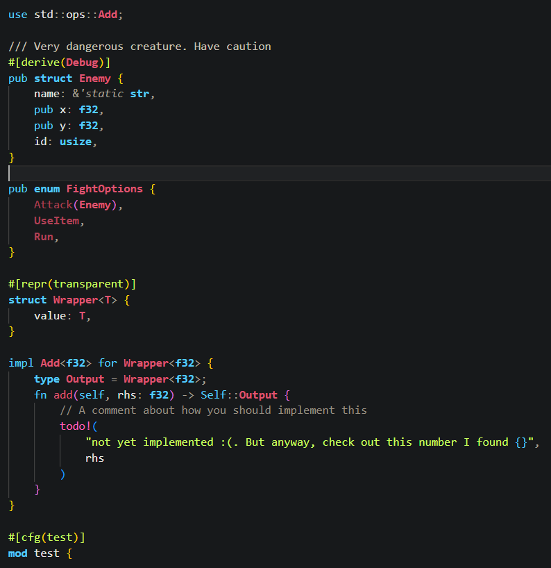
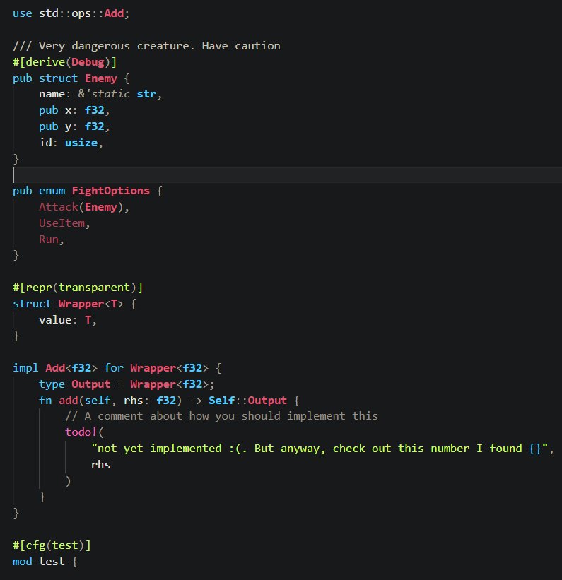
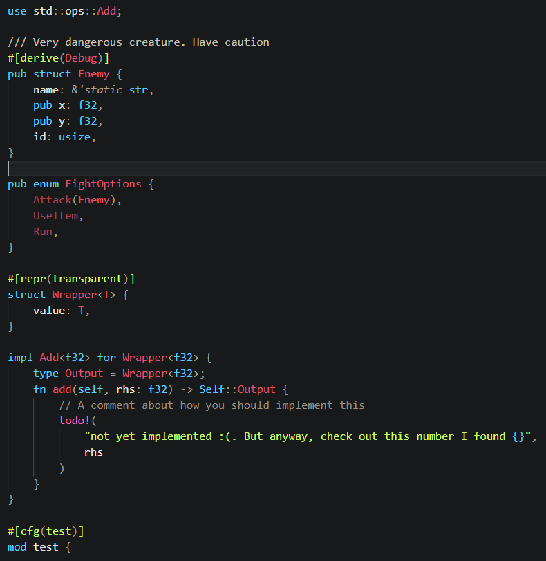

# clean-theme

A nice, clean, dark mode theme for VS Code.

This theme is based on how some websites render Markdown code blocks, including leetcode.

Comes with an extra variant that disables colorised bracket pairs.

---

Colorized Bracket Pairs (standard):

Mono-colored brackets:

Mono-colored brackets (No bold text):

## How to install

(Currently unavailable in the Vs Code extension marketplace)

Prerequisites:

- Have [nodejs and npm](https://docs.npmjs.com/downloading-and-installing-node-js-and-npm) installed

Installation guide:

1. Clone this repository
2. Run `npm install` in the terminal (if you haven't done so already)
   - This should only need to be done once for this project
3. Run `npm run package` in the terminal
   - This should generate a .vsix file, named `clean-theme-X.X.X.vsix` (where X.X.X is the project's version)
4. Run `code --install-extension clean-theme-X.X.X.vsix` to add the extension to Vs Code
5. The themes should now be added to Vs Code, and can be selected under color themes
